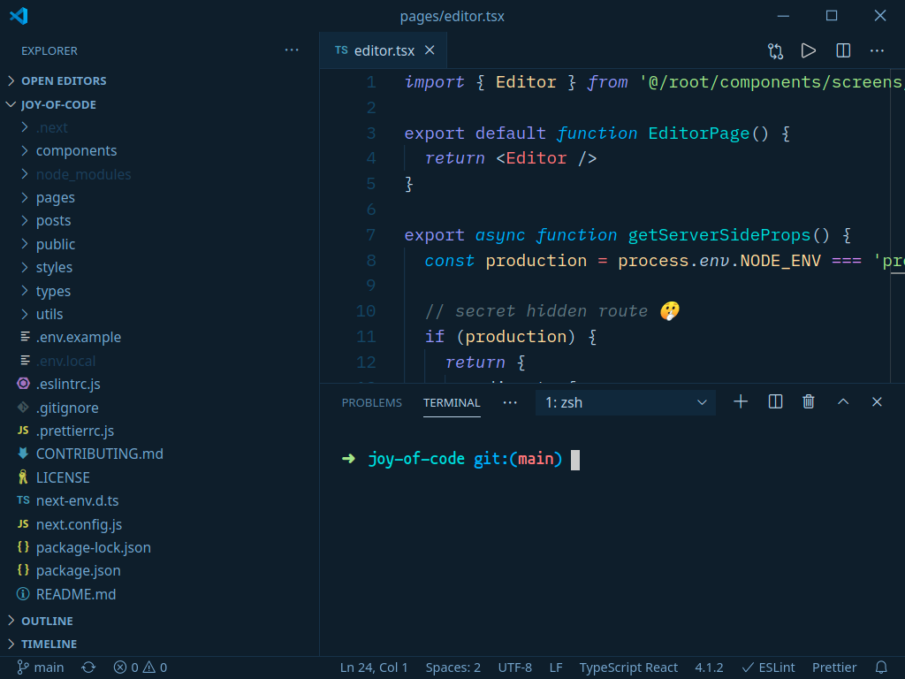

# Night Howl 🐺

Pleasing dark night blue theme for VS Code to keep you focused. Based on [Night Wolf](https://marketplace.visualstudio.com/items?itemName=MaoSantaella.night-wolf).

## Theme Preview

## Installation

1. Install [Visual Studio Code](https://code.visualstudio.com/)
2. View > Extensions
3. Search for "Night Howl" and install
4. File > Preferences > Color Theme
